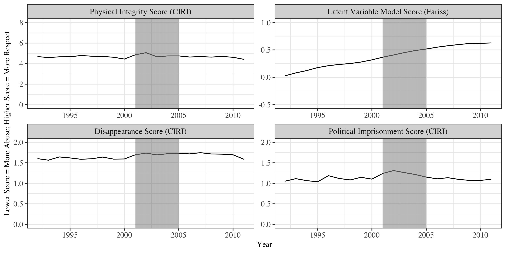
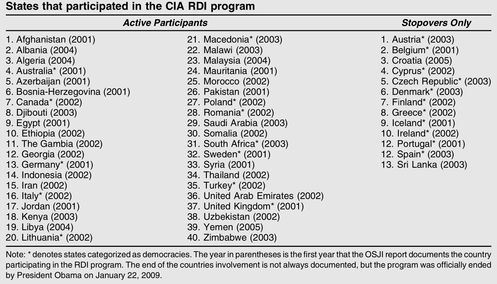
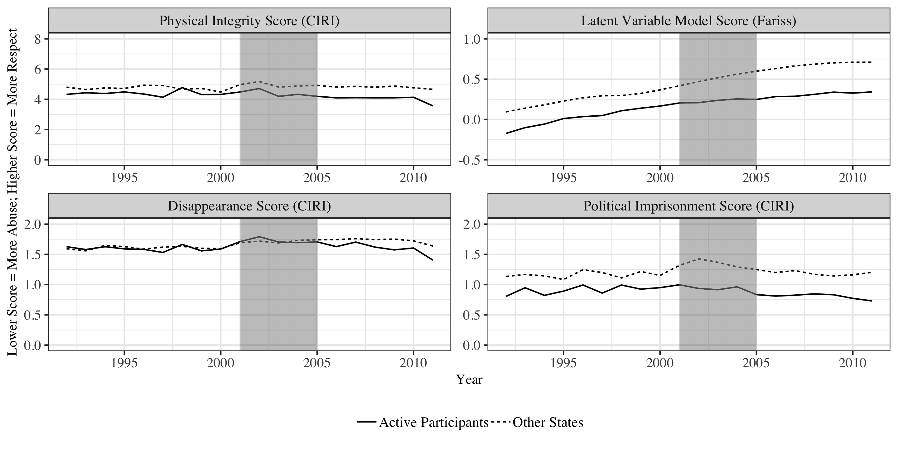
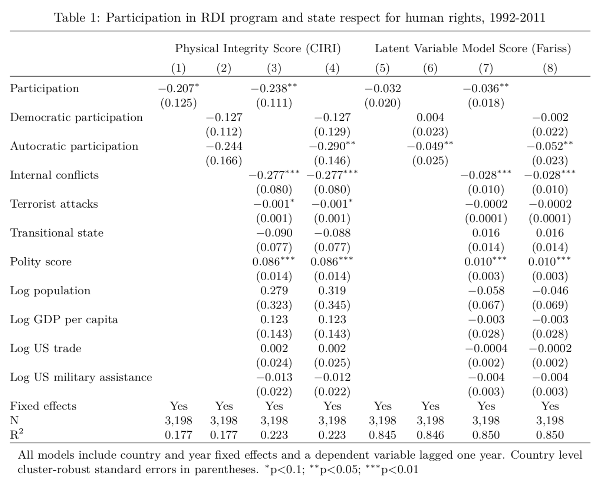
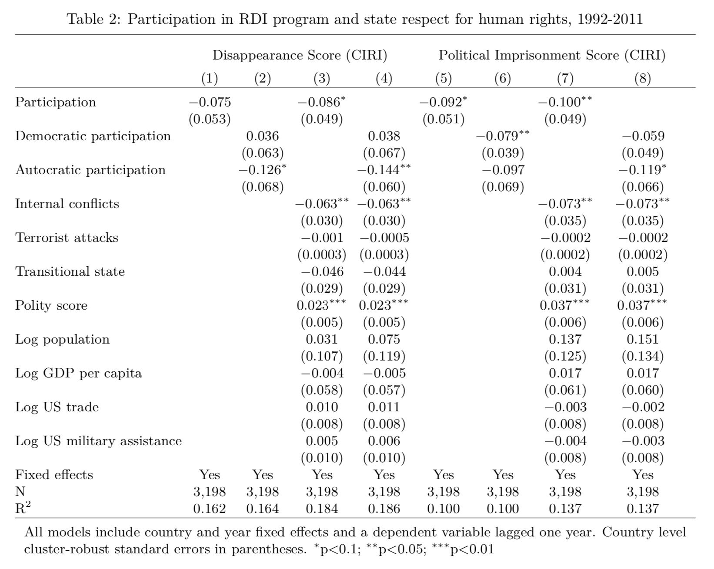

```{r xaringan-themer, include = FALSE}
# Attaching libraries
library(xaringanthemer)
library(knitr)

# Setting up the theme for the slideshow
mono_light(base_color = "#00113a",
           header_font_google = google_font("Oswald"),
           text_font_google   = google_font("Oswald", "300", "300i"),
           code_font_google   = google_font("Droid Mono")
)
```

```{r setup, include=FALSE}
options(htmltools.dir.version = FALSE)
```

# What is the RDI program?
- The Rendition, Detention, and Interrogation program
  - A CIA program
  - Allows for the secret kidnapping, detention, and interrogation of suspected terrorists
  - Introduced by President Bush in response to 9/11
<br/> <br/>
- Over 160 countries adopted and participated in the program
  - A global coalition of interrogators
  - Violates human rights laws
<br/> <br/>
- The program ended in January of 2009
  - Talk about reinstating the program has been initiated by President Trump 

---
# The Paper
- The focus is to find a clear association between RDI participation and human
rights conditions in the countries of practice
<br/><br/>
- Looks to find contradictions within US policy on the RDI program and prior
legislation on the issue of torture 
  - Example: 1999, UN Committee against Torture the US Government stated that
  torture is prohibited throughout the US
  - In the literature, torture is considered a cruel, inhuman, and degrading treatment
<br/><br/>
- The goal of this paper is to state that programs like RDI are ineffective and
should not be considered as feasible options for intelligence collection
  - Additionally, it is argued that U.S. policies may have caused a negative
  global shift in human rights practices.

---
# The Data
- Cingranelli-Richards (CIRI) Human Rights Data project from 1992-2011
  - Aggregate physical integrity rights index
  - Political imprisonment 
  - Disappearances
<br/><br/>    
- Fariss Model
  - Quantifies standards of accountability
<br/><br/> 
- Variables of Interest
  - Regime type (Democratic - Autocratic states, political transition)
  - Participation in the CIA RDI program
  - Government respect for core physical integrity rights

---
class: center, middle, inverse
# The Results

---
class: center, middle
# Figure 1: Global Human Rights Indicators
```{r echo = FALSE, warning = FALSE}

```
---
# What it shows...
- Shading highlights the 2001–2005 period where other countries began to adopt RDI
<br/><br/> 
- CIRI data figuress no change in human rights practices during the study period
<br/><br/> 
- Fariss data shows that human rights practices have improved consistently since
the end of the Cold War
<br/><br/> 
- RDI program doesn't seem to have impacted global human rights practices
---
class: center, middle

# Table 1: The Participants
```{r echo = FALSE, warning = FALSE}

```

---
# What it shows...
- There were 53 countries that participated in assisting the CIA
<br/><br/>
- figuress the variety of countries that participated
  - The Open Society Justice Initiative provided data on who was an active participant
  - Stopovers, are where CIA flights were allowed to stop in relation to the RDI program

---
class: center, middle

# Figure 2: Active Participants Human Rights Indicators
```{r echo = FALSE, warning = FALSE}

```

---
# What it shows...
- Of the 40 countries actively participating in assisting the CIA RDI program:
<br/><br/>
  - The countries did not have worse human rights practices before the intiation of the program
  - Average respect for human rights of participating states appears to worsen
  relative to other countries
---
# Comparing Participation:
 - Difference- of-means tests 
  - Participants’ and non-participants’ average human rights practices in the
  three year period before 2001 (1998–2000) shows no statistically significant
  differences between in government respect for human rights
  
- The United States did not seek, on average, assistance from known human rights violators when in the RDI program.

---
class: center, middle

# Table 2: Active Participants Human Rights Indicators
```{r echo = FALSE, warning = FALSE}

```

---
class: center, middle

# Table 3: Active Participants Human Rights Indicators
```{r echo = FALSE, warning = FALSE}

```

---
# What it shows...
- These tables show that participation in the RDI program has a strong negative correlation with the human rights practices of less democratic countries
- The RDI program had lingering effects even after its end in January 2009

---
class: center, middle, inverse
# Question/Advice?